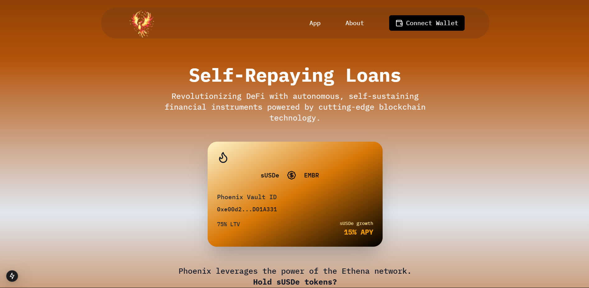

# Phoenix Protocol

A Self-Repaying Loan Protocol




## Overview

PhoenixVault is a cutting-edge decentralized finance protocol designed to provide users with flexible, self-repaying loans. By leveraging the innovative financial tech that Ethena labs has developed, we've created a lending ecosystem that prioritizes user empowerment and financial efficiency.

**The backbone of Phoenix lies in Ethena’s innovative staking mechanism, wherein the value of sUSDe is bound to increase and NOT decrease in any case.**

The USDe stablecoin is built on top of a sophisticated system that utilizes:
* **risk management**
* **asset management**
* **hedging**
* **The Reserve Fund**
This make both USDe and sUSDe very valuable assets.

## Project Architecture

### 📦 Core Components
The project's backend is meticulously structured to ensure robust functionality and security:

#### Smart Contracts
- **MocksUSDe.sol**: Imitaes the sUSDe token
- **EmberToken.sol**: The protocol's native utility token
- **PhoenixVault.sol**: Manages collateral, borrowing, and liquidation processes
- **PhoenixController.sol**: Governs protocol parameters and system-wide actions

### 💻 User Interface
A sleek, responsive Next.js application built with Tailwind CSS, providing an intuitive user experience.

## Key Features

### 🌐 Unique Lending Mechanism
- **Phoenix Vaults**: ERC721 Vaults, unique for each loan event, keeping track of key details
- **Collateral Deposit**: Lock sUSDe tokens in the vault
- **Flexible Borrowing**: Up to 75% loan-to-value ratio
- **Self-Reducing Debt**: Innovative negative interest model (-15% APY)

### ⚖️ Risk Management
- Automatic liquidation protection
- Transparent debt tracking
- Secure, audited smart contract infrastructure

## Getting Started

### Prerequisites
- Node.js
- Ethereum development environment (Hardhat/Ganache)
- Metamask Provider

### Installation

1. Clone the repository
   ```bash
   git clone https://github.com/leif-runescribe/Phoenix-Protocol.git
   cd Phoenix-Protocol
   ```

2. Install dependencies
   ```bash
   # Smart contract dependencies
   cd core
   npm install

   # Frontend dependencies
   cd ../ui
   npm install
   ```

3. Deploy and Launch
   ```bash
   # Compile smart contracts
   cd ../core
   npx hardhat compile
   npx hardhat deploy --network localhost

   # Start frontend
   cd ../ui
   npm run dev
   ```

## Roadmap and Future Enhancements

- [ ] Oracle Integration
- [ ] Multiple Token lending and collateral options
- [ ] Enhanced governance mechanisms


**Built with 🔥 by the PhoenixVault Team**
